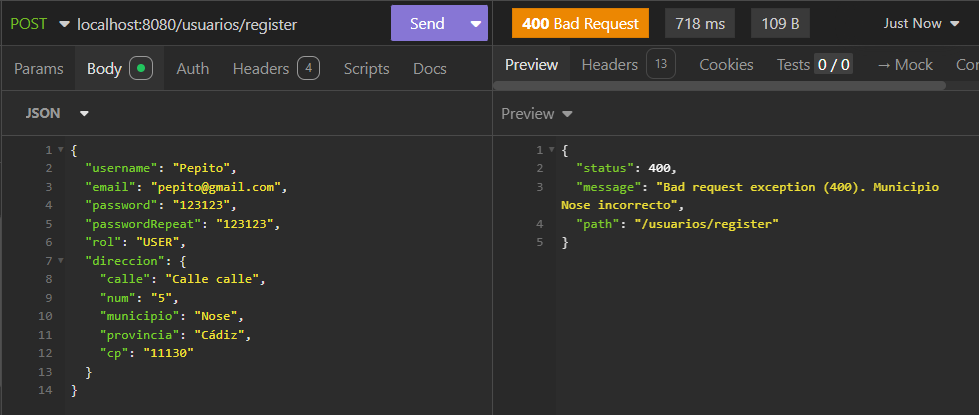
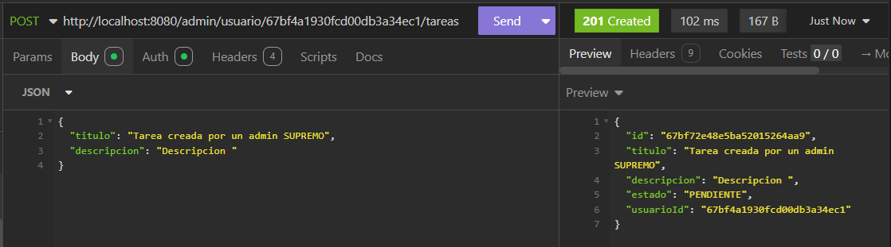

# Gestor de Tareas - App con Jetpack Compose y MongoDB

## Descripción del proyecto
Esta aplicación permite a los usuarios gestionar sus tareas de manera eficiente. Con una interfaz intuitiva y funcional, los usuarios pueden agregar, marcar como completadas y eliminar tareas. Además, la aplicación maneja errores mediante cuadros de diálogo, con mensajes claros e intuitivos.

Por otro lado, tiene una segunda pantalla o zona de Administrador, donde un usuario que tenga el rol ADMIN, puede gestionar lass tareas de cualquier usuario registrado en el sistema que aloja la App. Es decir, puede tanto crearle tareas, como eliminarlas, editarlas, ver todas las tareas del sistema, ver todas las tareas de algun usuario concreto, etc...

## Características principales
- Registro e inicio de sesión: Permite a los usuarios autenticarse. Lógica realizada mediante la API REST creada en SpringBoot usando seguridad con JWT y otros métodos, como encriptación a la hora de guardar la contraseña, etc...
- Base de datos usada para ello, MongoDB.
- Interfaz basada en JetpackCompose, haciendo la unión con la API mediante [**RetroFit**](app/src/main/java/com/appTareas/retrofit/ApiService.kt).

## Usabilidad

La aplicación está diseñada para ser fácil de usar, con una interfaz clara y botones accesibles. Algunas características clave son:

- Diseño intuitivo y claro.
- Mensajes de error visibles: Los errores se muestran en cuadros de diálogo para no afectar la navegación.
- Flujo de usuario optimizado: Se minimiza la cantidad de pasos necesarios para realizar acciones comunes.
- Modo oscuro y modo claro alternable, a elección del usuario. Haciendo uso de **MaterialTheme.colorScheme**

## Ejemplo de funcionalidad
Disponible una prueba visual de la App en el archivo de video adjunto al proyedcto.

## Futuras implementaciones
La idea es conitnuar este desasrollo en el tiempo, implementandon nuevas características y funcionalidades que mejoren la experiencia del usuario tales como:

- Añadir notificaciones y recordatorios
- Sistema de arrastrar y soltar tareas, apra reorganizarlas de una manera sencilla
- Creación de un widget en la pantalla de inicio para permitir ves tus tareas de un vistazo rápido
- Añadir calendario, y posible sincronización con Google Calendar o similares.

-------

# DOCUMENTACIÓN API
# Nombre del proyecto: Gestión Tareas del Hogar

# Descripción de los documentos y sus campos

### Documento Usuario

Representa a un usuario de la Aplicación:

- id
- username
- email
- password
- role
- direccion

### SubDocumento Direccion

Representa la Dirección de un Usuario:

- calle
- num
- municipio
- provincia
- cp

### Documento Tarea

Representa una tarea en la Aplicación:

- id
- titulo
- descripcion
- estado
- usuario_id

# Endpoints

### Autenticación (Público)

- POST usuarios/register
- POST usuarios/login

### USER 

- GET /tareas
- GET /tareas/{tareaId}
- POST /tareas
- PUT /tareas/{tareaId}
- DELETE /tareas/{tareaId}
- DELETE /tareas

### ADMIN

- GET /admin/tareas
- GET /admin/usuario/{usuarioId}/tareas
- POST /admin/usuario/{usuarioId}/tareas
- PUT /admin/tareas/{tareaId}/usuario/{usuarioId}
- DELETE /admin/tareas/{tareaId}/usuario/{usuarioId}
- DELETE /admin/usuario/{usuarioId}/tareas

# Decripción Endpoints

### Autenticación

Estos métodos podrán ser accedidos por todos, sin excepción de roles.

| MÉTODO |        URI        |                        Descripción                       |
|:------:|:-----------------:|:--------------------------------------------------------:|
|  POST  | usuarios/register |             Permite el registro de un usuario            |
|  POST  |   usuarios/login  | Permite iniciar sesión a un usuario devolviendo el token |

### USER Y ADMIN

| MÉTODO |        URI        |                       Descripción                       |
| :-----: |:-----------------:| :------------------------------------------------------: |
|   GET   |      /tareas      |     Obtener todas las tareas del usuario autenticado     |
|   GET   | /tareas/{tareaId} | Obtener una tarea mediante su ID del usuario autenticado |
|  POST  |      /tareas      |               Crear una nueva tarea propia               |
|   PUT   | /tareas/{tareaId} |         Editar una tarea propia mediante su ID.         |
| DELETE | /tareas/{tareaId} |        Eliminar una tarea propia mediante su ID.        |
| DELETE |      /tareas      |            Eliminar todas las tareas propias.            |

### ADMIN

| MÉTODO |                     URI                     |                                  Descripción                                   |
|:------:|:-------------------------------------------:|:------------------------------------------------------------------------------:|
|  GET   |                /admin/tareas                |                Obtener todas las tareas de todos los usuarios.                 |
|  GET   |      /admin/usuario/{usuarioId}/tareas      |                    Obtener todas las tareas de un usuario.                     |
|  POST  |      /admin/usuario/{usuarioId}/tareas      |          Crear una nueva tarea a un usuario concreto mediante su ID.           |
|  PUT   | /admin/tareas/{tareaId}/usuario/{usuarioId} | Marca como hecha una tarea concreta de un usuario concreto mediante ambas IDs. |
| DELETE | /admin/tareas/{tareaId}/usuario/{usuarioId} |     Eliminar una tarea concreta de un usuario concreto mediante ambas IDs.     |
| DELETE |      /admin/usuario/{usuarioId}/tareas      |        Eliminar todas las tareas de un usuario concreto mediante su ID.        |

# Lógica de negocio

Cualquier usuario va a tener acceso tanto al login como al register.
En cuanto al rol USER, unicamente va a poder ver, editar, marcar como hecha, eliminar o añadir una tarea si es suya propia.
El rol ADMIN, podra hacer todo lo anterior, pero de cualquier otro usuario, no solo del suyo propio.
También podra ver todas las tareas en general o todas las tareas de un usuario en concreto, así como eliminar una o todas las tareas de un usuario cualquiera.

# Excepciones y códigos de estado

|       Excepción       | Codigo estado HTTP |                                                                        Descripción                                                                        |                                                  Mensaje                                                  |
| :--------------------: | :----------------: | :---------------------------------------------------------------------------------------------------------------------------------------------------------: | :--------------------------------------------------------------------------------------------------------: |
|  BadRequestException  |        400        | Se lanza cuando la solicitud realizada por el cliente es incorrecta o no válida, como cuando faltan parámetros obligatorios en el cuerpo de la solicitud. |                      Bad request exception (400). + El mensaje concreto de cada caso                      |
|   NotFoundException   |        404        |                                                    Se lanza cuando no se encuentra un recurso solicitado                                                    |                        Not Found Exception (404).+ El mensaje concreto de cada caso                        |
|   ConflictException   |        409        |                         Se lanza cuando se intenta crear o modificar un recurso que entra en conflicto con un recurso ya existente                         |                        Conflict Exception (409). + El mensaje concreto de cada caso                        |
| AlreadyExistsException |        409        |                         Se lanza cuando se intenta crear o modificar un recurso que entra en conflicto con un recurso ya existente                         |                        Conflict Exception (409). + El mensaje concreto de cada caso                        |
| UnauthorizedException |        401        |                   Se lanza cuando el usuario no está autenticado o no ha proporcionado credenciales válidas para acceder a un recurso.                   |                      Unauthorized Exception (401). + El mensaje concreto de cada caso                      |
|   ForbiddenException   |        403        |                      Se lanza cuando el usuario no tiene permisos suficientes para acceder a un recurso, incluso si está autenticado.                      |                       Forbidden Exception (403). + El mensaje concreto de cada caso                       |
|  InternalServerError  |        500        |      Se lanza para capturar cualquier otro tipo de error no controlado por las excepciones anteriores. Esto puede ser un error de servidor inesperado.      | InternalServerError (500). An unexpected error ocurred (o algun otro personalizado en algun caso concreto) |

# Restricciones de seguridad

Se aplicará las siguientes restricciones:

- Autenticación con JWT para la identificación de usuarios.
- Hashing de contraseñas mediante bcrypt.
- Roles y permisos para restringir acciones.
- Validación de datos para evitar inyecciones y errores.

# Pruebas gestión usuarios

### Register

##### Registro correcto

- Registro desde insmonia USER

- Registro desde insmonia ADMIN

- Inserción en MongoDB de los diferentes usuarios

##### Excepciones registro

- Nombre de Rol incorrecto

- Nombre ya en uso / Correo ya en uso

- Provincia, municipio no encontrado

### Login

#### Login Correcto

- Login insomnia

  

#### Excepciones Login

- Credenciales incorrectas

- Credenciales incorrecta interfaz
  
 

********

# Pruebas gestión tareas - ROL USER

**En todos los casos se está comprobando la autenticación del usuario, no lo mostraré en cada apartado para no ser repetitivo innecesariamente. Configuración:**

**Ejemplo de no usar un token válido:**

------------

#### Crear tarea 

- Datos válidos

- Datos no válidos

#### Obtener una tarea del usuario mediante la ID

- Id válida

- Id inexistente

- Intentar ver una tarea de otro usuario

#### Obtener una tarea del usuario mediante la ID

#### Cambiar el estado de una tarea

- Id de una tarea propia (Cada vez que se ejecuta cambia de "PENDIENTE" a "COMPLETADA" y viceversa)

- Id de una tarea de otro usuario

- Id no válida

#### Eliminar una tarea propia mediante su ID

- Id de una tarea propia

- Id de una tarea de otro usuario

- Id no válida

#### Eliminar todas las tareas propias

- Cuando tiene tareas propias

- Cuando no tiene tareas (Lanzo excepcón con el mensaje para informar, aunque se podría y debería devolver la lista de tareas vacía simplemente. Lo hago para que sea visual en esta documentación)

--------

# Pruebas gestión tareas - ROL ADMIN

**En este apartado también como he mostrado antes en el Config, se comprueba en todo momento que el usuario tenga el rol ADMIN. Para no repetir las pruebas, la pondré una sola vez en el siguiente apartado de obtener todas las tareas del sistema.**

#### Obtener todas las tareas del sistema

- Usando el token de un usuario "ADMIN"

- Usando token de un usuario "USER"

#### Obtener todas las tareas de un usuario

- Cuando tiene tareas

- Cuando no tiene tareas (lanzo excepción a modo informativo y visual)

#### Crear tarea para un usuario cualquiera

- Id de usuario válida

- Id de usuario no válida

- Campos del body inválidos

#### Cambiar estado de una tarea cualquiera de un usuario cualquiera

- Usando Id de un usuario cualquiera y Id de una tarea suya

- Usando Id de usuario cualquiera y Id de una tarea de otro usuario

- Id de usuario que no existe

- Id de tarea que no existe

#### Eliminar una tarea concreta de un usuario cualquiera

- Id de usuario y Id de una tarea suya

- Id de usuario y Id de una tarea de otro usuario

**Igual que antes, en caso de alguna Id no válida, salta la misma excepción (NotFoundException)**

#### Eliminar todas las tareas de un usuario cualquiera

- Usuario con tareas

- Usuario sin tareas (Excepción a modo informativo)

